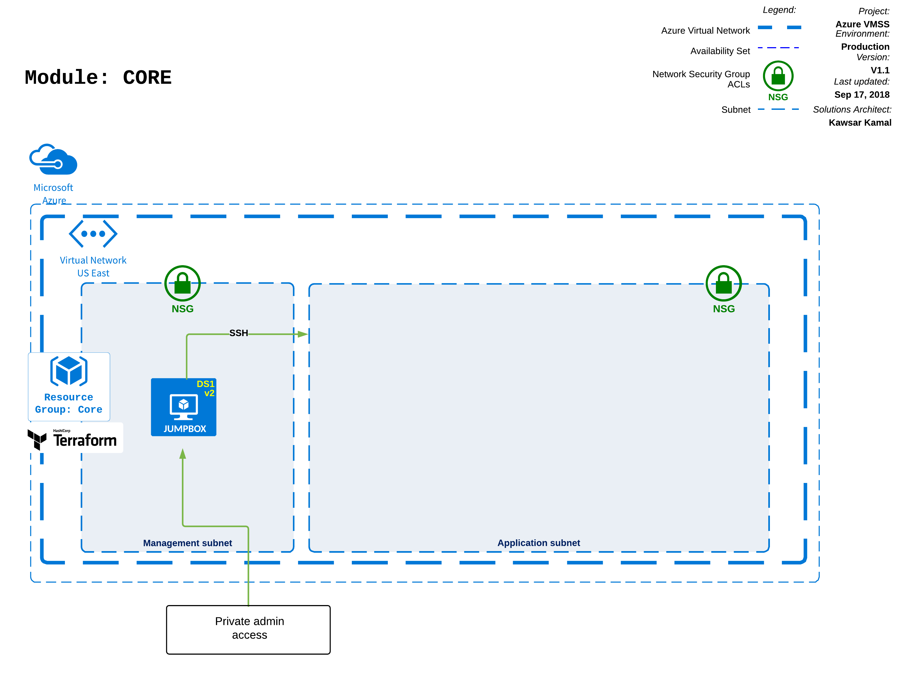
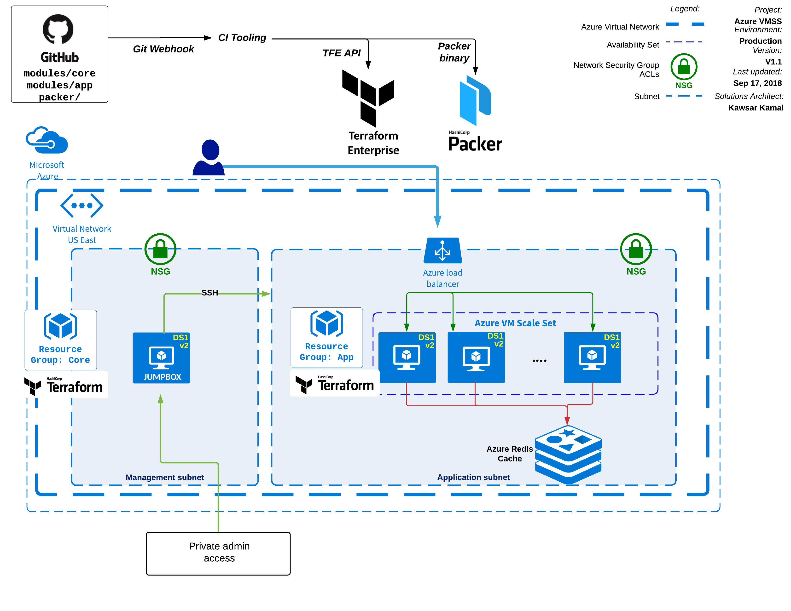

## terraform-azure-vmss-module-core
Terraform Core module for use with a Terraform Enterprise Private Module Repository. This module provisions an Azure VNET, Subnet and Bastion Host.
- Dependency: None
- Example: see example instantiation in [examples/simple/main.tf](examples/simple/main.tf)

### Core Module diagram:

### Terraform Azure VMSS architecture diagram:

